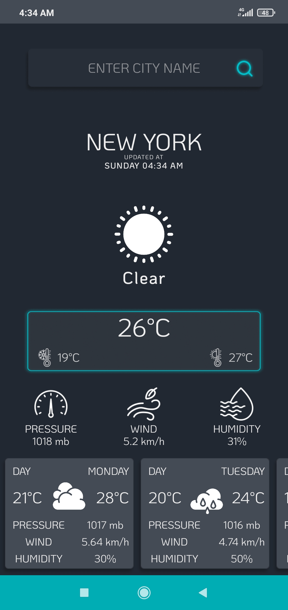
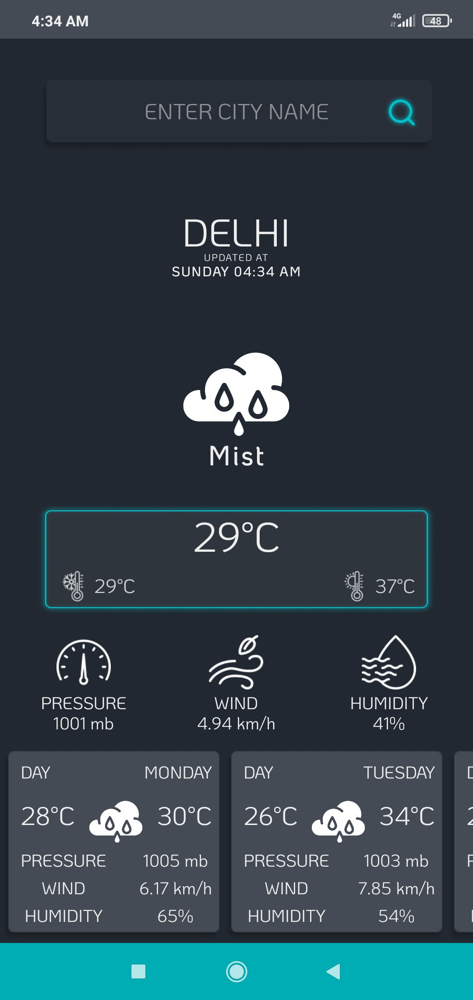

# 🌤️ Weather Forecast — Android App

A clean and modern Android weather application that provides real-time weather data and a 7-day forecast using the OpenWeatherMap API. Users can search by city name, use voice input, or let the app detect their location automatically.

---

## 📱 Screenshots

| Home Screen | Forecast View |
|-------------|---------------|
|  |  |

---

## ✨ Features

- 🌍 **Auto Location Detection** — Automatically fetches weather based on the user's GPS coordinates
- 🔍 **City Search** — Search weather for any city worldwide by typing the city name
- 🎙️ **Voice Search** — Search cities using voice input via microphone
- 📅 **7-Day Forecast** — Weekly weather forecast displayed in a scrollable list
- 🌡️ **Detailed Weather Info** — Temperature (current, min, max), humidity, wind speed, pressure, sunrise & sunset times
- 🔄 **Pull-to-Refresh** — Swipe down to refresh weather data instantly
- 🌙 **Dark Mode Support** — Adapts to system dark/light theme
- 🌐 **Multi-language Support** — Available in English, German (de), Spanish (es), and French (fr)
- 📲 **In-App Updates** — Notifies users when a new version is available via Google Play Core
- 🎨 **Lottie Animations** — Smooth animated weather icons
- 📐 **Responsive UI** — Scales properly across different screen sizes using SDP

---

## 🛠️ Tech Stack

| Category | Technology |
|---|---|
| Language | Java |
| Min SDK | API 19 (Android 4.4 KitKat) |
| Target SDK | API 33 (Android 13) |
| Build System | Gradle |
| UI | XML Layouts + ViewBinding |
| Networking | Volley |
| Location | Google Play Services — FusedLocationProviderClient |
| Animations | Lottie |
| Weather API | OpenWeatherMap (`onecall` + `weather` endpoints) |

---

## 📦 Dependencies

```gradle
// Networking
implementation 'com.android.volley:volley:1.2.1'

// Location
implementation 'com.google.android.gms:play-services-location:21.0.1'

// Custom Toast
implementation 'com.github.dev-aniketj:roasted-toast:1.0.2'

// Loading Spinner
implementation 'com.github.ybq:Android-SpinKit:1.4.0'

// Swipe to Refresh
implementation 'androidx.swiperefreshlayout:swiperefreshlayout:1.1.0'

// In-App Updates
implementation 'com.google.android.play:core:1.10.3'

// Responsive Screen Sizes
implementation 'com.intuit.sdp:sdp-android:1.1.0'

// Lottie Animations
implementation 'com.airbnb.android:lottie:5.2.0'

// Multi Dex
implementation 'androidx.multidex:multidex:2.0.1'
```

---

## 🚀 Getting Started

### Prerequisites

- Android Studio (Arctic Fox or later)
- Android device or emulator running API 19+
- OpenWeatherMap API key (free at [openweathermap.org](https://openweathermap.org/api))

### Installation

1. **Clone the repository**
   ```bash
   git clone https://github.com/aniketjain/WeatherApp-Android.git
   cd WeatherApp-Android
   ```

2. **Add your API Key**

   Open `app/src/main/java/com/aniketjain/weatherapp/location/LocationCord.java` and replace the existing key:
   ```java
   public final static String API_KEY = "YOUR_OPENWEATHERMAP_API_KEY";
   ```

3. **Open in Android Studio**
   - File → Open → Select the project folder
   - Let Gradle sync complete

4. **Run the app**
   - Connect a device or start an emulator
   - Click ▶️ Run

---

## 📁 Project Structure

```
app/src/main/java/com/aniketjain/weatherapp/
│
├── HomeActivity.java          # Main screen — weather data, search, voice input
├── SplashScreen.java          # Launch screen
│
├── adapter/
│   └── DaysAdapter.java       # RecyclerView adapter for 7-day forecast
│
├── location/
│   ├── CityFinder.java        # Resolves city name from GPS coordinates
│   └── LocationCord.java      # Stores lat/lon and API key
│
├── network/
│   └── InternetConnectivity.java  # Checks network availability
│
├── toast/
│   └── Toaster.java           # Custom toast helper
│
├── update/
│   └── UpdateUI.java          # Handles in-app update UI
│
└── url/
    └── URL.java               # Builds OpenWeatherMap API URLs
```

---

## 🔑 Permissions

| Permission | Reason |
|---|---|
| `INTERNET` | Fetch weather data from API |
| `ACCESS_NETWORK_STATE` | Check internet connectivity |
| `ACCESS_COARSE_LOCATION` | Approximate location for weather |
| `ACCESS_FINE_LOCATION` | Precise GPS location |

---

## 🌐 API Reference

This app uses the **OpenWeatherMap API**:

- **One Call API** (current + forecast by coordinates):
  ```
  https://api.openweathermap.org/data/2.5/onecall?exclude=minutely&lat={lat}&lon={lon}&appid={API_KEY}
  ```

- **Weather by City Name**:
  ```
  https://api.openweathermap.org/data/2.5/weather?q={city}&appid={API_KEY}
  ```

> ⚠️ The One Call API requires a paid plan on newer OpenWeatherMap accounts. Consider using the free `forecast` endpoint as an alternative.

---

## 🤝 Contributing

1. Fork the repository
2. Create a new branch (`git checkout -b feature/your-feature`)
3. Add screenshots of your changes
4. Write a description of 100+ words explaining your changes
5. Open a Pull Request

See [CONTRIBUTING.md](CONTRIBUTING.md) for details.

---

## 🔒 Security

Please do not commit your API key to version control. See [SECURITY.md](SECURITY.md) for reporting vulnerabilities.

---

## 📄 License

This project is open-source. See the repository for license details.

---

## 👤 Author

**Ayush Gupta** — [@ayushgupta](https://github.com/Ayush-2308)
